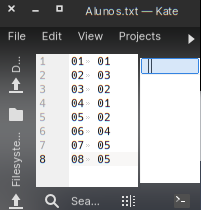
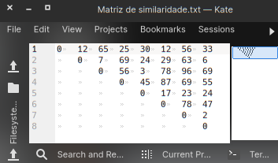
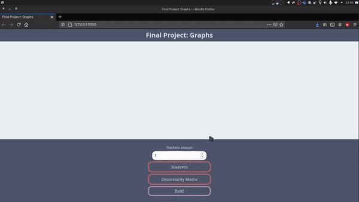

  

  <a href="#about">About</a>
   &nbsp;&nbsp;&nbsp;|&nbsp;&nbsp;&nbsp;
    <a href="#algorithm">Algorithm</a>
  &nbsp;&nbsp;&nbsp;|&nbsp;&nbsp;&nbsp;
  <a href="#techs">Techs</a>
  &nbsp;&nbsp;&nbsp;|&nbsp;&nbsp;&nbsp;
  <a href="#run">Run</a>
&nbsp;&nbsp;&nbsp;|&nbsp;&nbsp;&nbsp;
  <a href="#license">License</a>

## About

This is a Kruskal Graph algorithm application to solving the problem bellow

### Problem

Basically, there is an educational institution where the department of stock that has undergraduate, master's and doctorate courses. Altogether, there are _N_ students and _K_ teachers, at all levels of education. In addition, all students are I work with research work in some area of ​​research

The degree of relationship between students is measured by the proximity between the themes of their work of research. In this way, it is desired to allocate the _K_ work teachers to guide the research work of the students, with each teacher being allocated to guide a group of students with similar jobs. The _N_ number of students is greater than the number _K_ for teachers, so each teacher will mentor one or more students

## Algorithm

First, it is necessary to model the problem following the graph theory, for this, from reading the two files, we have two data structures, the first being an object with a property that identifies the student and another property that identifies the research area. of the student, data that were extracted from the file "_Student_Code_Area_Code_". And the second data structure was a matrix extracted from reading the file "_Matrix_"

From the data structures, a complete graph was generated, in which the vertices were the students and the edges the connection between the students and the weight of the edges the dissimilarity between them. For this, a function was created that receives these two structures and performs the following procedure:

- Instantiate a vector to store the edges;

- Perform two repetition loops to perform all combinations;

- For each iteration, add an object instance in the array that has where the edge starts (student code 1), where the edge ends (student code 2) and the distance between them, for which a query is made in the dissimilarity matrix from the students' research areas;

- Return the vector with the list of edges.

From the return of the function, this data is sent to a function that uses the Kruskal algorithm, to generate the minimum tree. Kruskal's algorithm was chosen because it would be better adapted to the data structures already obtained. After returning from the tree, the number of teachers minus 1 unit is removed to separate groups between teachers. Thus obtaining the groups that have less dissimilarity

## Techs

- HTML5

- CSS3

- JavaScipt

## Run

1. Access the Website

   [Website](https://trabalho-grafos.netlify.app/)

2. Create an inputable file

   **You must have use .txt and following the format below**

   1. Students
    

   
   

   2. Dissimilarity Matrix
     

   
   

   3. Build
   

    
    

## License

This project is under the MIT license. See the file [LICENSE](LICENSE) for more details.

### 
Status

 

  

